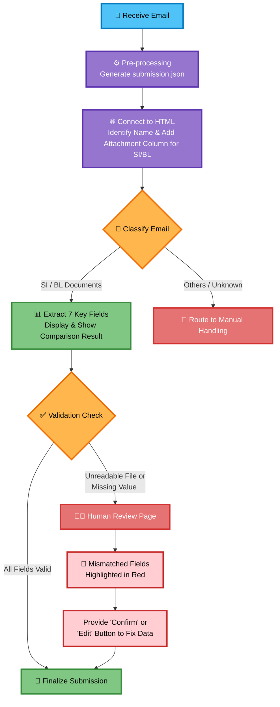

# 🚀 Accidentally-Intelligent

> *"Automating the routine, empowering the exceptional. Let AI handle the noise so humans can solve the signal."*  
> 🏆 Proudly built for the **Averis x Monash Hackathon 2026**

---

## 👥 Team & Project Overview
- **Team Name:** Accidentally Intelligent  
- **Project Name:** Accidentally-Intelligent (AI-Powered Email Classification & Review Pipeline)  
- **Mission:** To eliminate the bottleneck of manual email review by deploying an intelligent, automated classification system that handles routine tasks, leaving only complex edge cases for human experts.

---

## 🎯 The Problem
In high-volume operational environments, workers are forced to review emails and documents one by one. This manual process is:
1. **Highly Time-Consuming:** Valuable human hours are wasted on routine sorting and categorization.
2. **Prone to Human Error:** Fatigue and repetitive tasks inevitably lead to unintended mistakes, misclassifications, and compliance risks.
3. **Inefficient:** Skilled workers are bogged down by trivial tasks instead of focusing on complex problem-solving that requires human judgment.

Specifically, the need to accurately and rapidly classify **SI** and **BL** emails demanded a smarter, automated approach.

---

## 🏗️ Technical Architecture
Our solution is a modular, end-to-end pipeline that seamlessly bridges backend AI processing with a user-friendly frontend dashboard:

1. **Data Ingestion (`loader.py`)**: Securely extracts and parses incoming email data and attachments, preparing them for analysis.
2. **Core AI Processing (`pipeline.py`)**: Orchestrates the intelligent classification engine, analyzing content to automatically categorize emails (e.g., SI, BL) with high confidence.
3. **Validation Layer (`validate_pipeline.py`)**: Ensures data integrity, checks classification confidence scores, and flags anomalies. 
4. **Output Generation**: Structures the processed results into a standardized `submission.json` for seamless frontend consumption.
5. **Interactive Frontend (`login.html`, `frontpage.html`, `Comparison.html`)**: A clean, intuitive web interface where workers can log in, view the AI's classifications, and easily step in *only* when the AI flags an item it cannot confidently solve.
6. **Resources (`/resources`)**: Centralized static assets, configurations, and model references.



---

## ⚙️ Implementation Details
- **Smart Pre-processing**: Incoming emails are automatically parsed into a structured `submission.json` format. The system identifies the sender's name and dynamically adds an attachment column specifically for SI and BL documents.
- **7-Point Field Extraction**: For classified SI and BL emails, the AI automatically extracts 7 key data fields and displays them alongside a comparison result for quick verification.
- **Visual Error Highlighting**: In the Human Review interface, any mismatched fields or missing values are automatically **highlighted in red**, drawing the reviewer's attention exactly where it's needed.
- **Interactive Human-in-the-Loop**: When an unreadable file or missing value is detected, it is routed to a dedicated review page. The system states the exact reason for the flag and provides **"Confirm" or "Edit" buttons**, allowing workers to quickly fix the field data without leaving the dashboard.
- **Edge Case Handling**: Emails classified as "Others" are seamlessly routed to a separate manual handling flow, ensuring the AI only processes what it's trained for.

> 📸 **[Insert Screenshot 2]**: *Frontend Dashboard*  
> *(Tip: Add a screenshot of your `frontpage.html` or `Comparison.html` showing the AI classification in action!)*

---

## ✅ What We Solved
- **Drastically Reduced Review Time**: Automated the bulk sorting of SI and BL emails, freeing up countless hours of manual labor.
- **Eliminated Routine Human Error**: Removed fatigue-induced mistakes from the initial classification stage, ensuring higher baseline accuracy.
- **Optimized Human Capital**: Empowered workers to focus their mental energy and expertise solely on complex, high-value exceptions that the AI cannot resolve.
- **Seamless Workflow Integration**: Provided a lightweight, easy-to-adopt web interface that requires minimal training for end-users.

---

## 🧗 Challenges Faced
- **Challenge 1: Balancing AI Automation with Human Oversight**  
  *How we overcame it:* We designed the `validate_pipeline.py` to not just check for errors, but to evaluate classification confidence. This ensures the AI knows when to "ask for help," creating a safe and reliable Human-in-the-Loop system.
- **Challenge 2: Parsing Diverse Email Formats**  
  *How we overcame it:* We built a resilient `loader.py` that normalizes varied email structures into a consistent format before it hits the classification pipeline, ensuring stable performance regardless of the sender's formatting.

---

## 🗺️ Future Roadmap
While we built a robust, functional foundation during the hackathon, here is our vision for the future:
1. **Advanced NLP Models**: Integrate larger, fine-tuned language models to improve the nuance and accuracy of SI and BL classifications.
2. **Modern Frontend Migration**: Port the HTML/JS interface to a modern framework (e.g., React or Vue) for enhanced state management and real-time updates.
3. **Enterprise Integration**: Develop APIs to connect directly with enterprise email servers (e.g., Microsoft Exchange, Gmail API) for fully automated, real-time ingestion.
4. **Feedback Loop**: Allow human reviewers to correct the AI's mistakes directly in the UI, using this feedback to continuously retrain and improve the model's accuracy over time.

---

## 🛠️ How to Run Locally
1. Clone the repository:
   ```bash
   git clone https://github.com/demons929/Accidentally-Intelligent.git
   cd Accidentally-Intelligent
