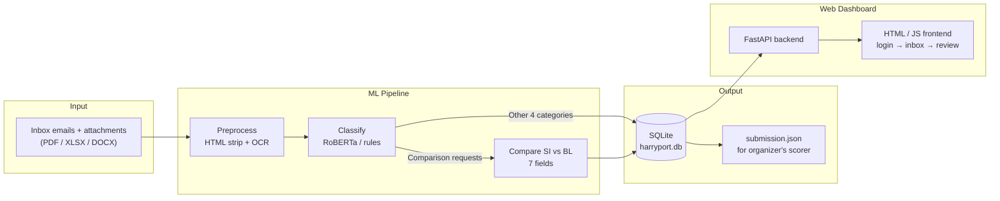
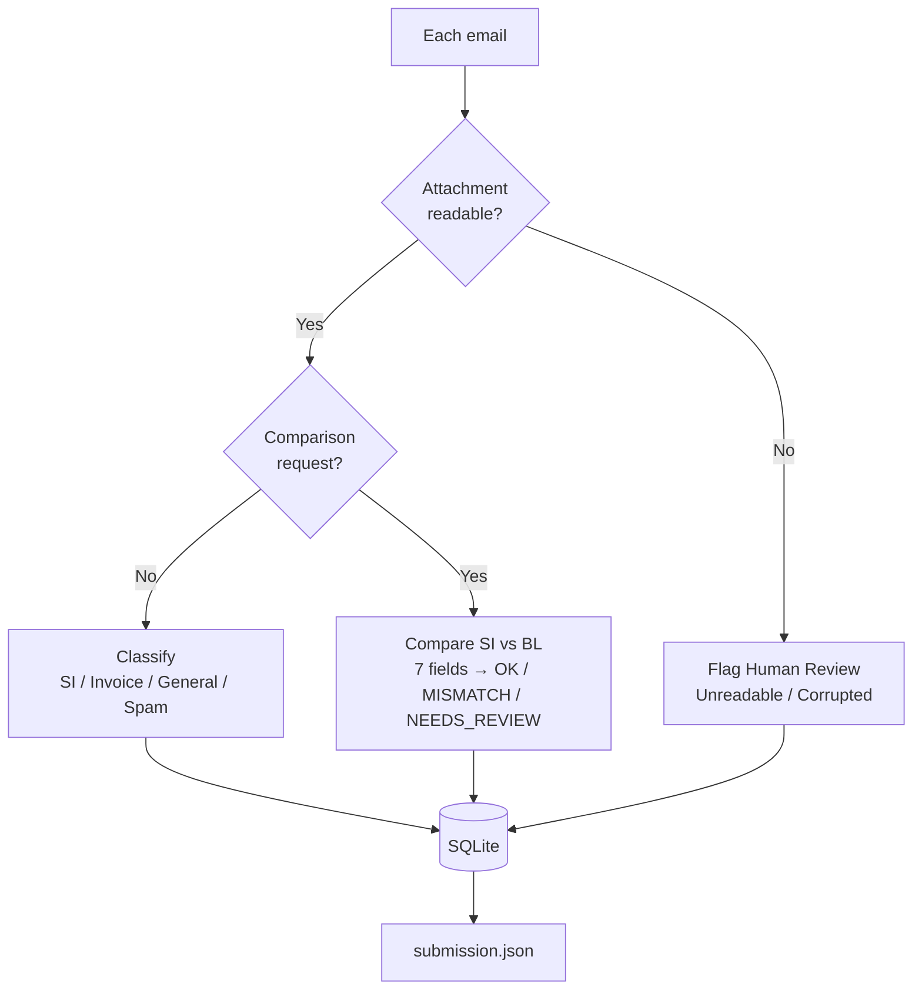
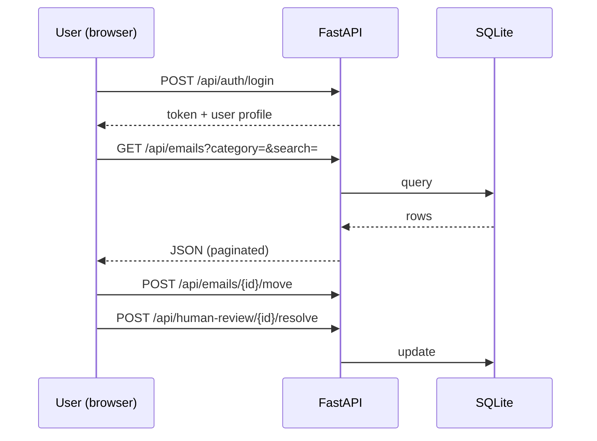

# Accidentally-Intelligent

**HarryPort — Email Classifier & SI/BL Document Verification**

*"HarryPort: Pure Logistics Magic"* — a complete system for the SDOC logistics hackathon that:


1. **Classifies** a logistics inbox into 5 categories,

2. **Verifies** Shipping Instruction (SI) vs Bill of Lading (BL) documents,

3. **Gives reviewers a web dashboard** to handle whatever the machine can't.


***

## Team Name and Project Name


|                  |                                                                         |
| ---------------- | ----------------------------------------------------------------------- |
| **Team Name**    | Accidentally-Intelligent                                                |
| **Project Name** | HarryPort                                                               |
| **Tagline**      | HarryPort: Pure Logistics Magic                                         |
| **Deliverables** | `submission.json` (scored by organizer's Docker server) + web dashboard |


***

## Problem

Shipping companies receive hundreds of emails a day. Most fall into five buckets:


| Category              | Example                                                   |
| --------------------- | --------------------------------------------------------- |
| `Comparison requests` | "Compare the SI with the draft BL and confirm the blanks" |
| `New SI requests`     | Booking / shipping instructions for a new shipment        |
| `Invoice queries`     | Billing questions                                         |
| `General mail`        | Everything else that matters                              |
| `Spam`                | Noise                                                     |

Two things make this hard:


1. **Attachments matter.** A comparison email is only meaningful if we can OCR the attached PDF / Excel / Word files. Password-protected PDFs and corrupted emails must go to a **human reviewer** — never be force-classified.

2. **Documents must be cross-checked.** The SI and BL list the same 7 core fields (shipper, consignee, notify party, ports, container count, gross weight). Any discrepancy must be flagged with the **exact fields** that differ.


***

## Technical Architecture




**Tech stack**


* **Language / ML:** Python 3.11+, HuggingFace `transformers` + PyTorch (`roberta-base`)

* **OCR:** `azure-ai-formrecognizer` with a `PyMuPDF` fallback (works offline)

* **Backend / data:** FastAPI + SQLite (SQLAlchemy)

* **Frontend:** Vanilla HTML + Tailwind + JavaScript — all data fetched from the API, nothing hardcoded

**Project layout**


```
Accidentally-Intelligent/

├── run\_pipeline.py        # ① inference + comparison → submission.json + DB

├── run\_server.py          # ② start the web dashboard

├── config.py              # settings (paths, formats, demo login)

├── pipeline/              # preprocess · inference · comparison · submission

├── backend/               # FastAPI app · routes · SQLite models

├── frontend/static/       # login.html · frontpage.html · Comparison.html

├── data/ · models/ · resources/ · tests/

└── submission.json        # generated for the organizer
```


***

## Implementation Details

### 1. Pipeline: inbox → 5 categories → submission





* **Clean & extract** — strip HTML, pull body text, OCR every attachment. If OCR throws or returns empty → `Unreadable Attachment`; if body parsing fails → `Corrupted Email`. The run **never crashes** on a bad file.

* **Classify** — fine-tuned `roberta-base` when `models/best_model` exists, otherwise a deterministic keyword/structure fallback. Exactly 5 categories, human-review flags for the rest.

* **Compare** — for comparison emails, extract the 7 SI/BL fields and produce `OK` / `MISMATCH` (with `defect_fields`) / `NEEDS_REVIEW` (with a `review_reason`: wrong doc type, missing attachment, unreadable, missing value).

**The 7 compared fields**


| Field               | Example SI label             | Example BL label          |
| ------------------- | ---------------------------- | ------------------------- |
| shipper             | `Shipper/Exporter`           | `SHIPPER`                 |
| consignee           | `Consignee (Non-Negotiable)` | `Consignee`               |
| notify\_party       | `NOTIFY PARTY`               | `Notify Party`            |
| port\_of\_loading   | `Port of Loading`            | `Port of Loading (POL)`   |
| port\_of\_discharge | `Discharge Port`             | `Port of Discharge (POD)` |
| container\_count    | `No. of Containers`          | `Container Count`         |
| gross\_weight\_kg   | `Gross Weight (KG)`          | `Gross Wt (kgs)`          |

Values are normalized before comparing, so `21,577 KG` matches `21577 kgs`.

### 2. Dashboard: FastAPI + browser





* Pages: `/` (login) → `frontpage.html` (Inbox + Human Review) → `Comparison.html` (SI-vs-BL verification)

* Human Review is a single unified table of **all** flagged emails (unreadable + corrupted, pending + resolved) with All / Pending / Resolved filters — no more separate duplicate lists.

* Demo login: `captain@harryport.com` / `pure_magic_2026`

* Key endpoints: emails list/filter/stats/move, human-review lists (unreadable / corrupted / resolved) + resolve, comparison list / detail / resolve

### 3. Quick start


```
pip install -r requirements.txt   # 1. dependencies

python run\_pipeline.py            # 2. build submission.json + seed the DB

python run\_server.py              # 3. dashboard at http://localhost:8000
```

Optional: `python pipeline/train.py` fine-tunes RoBERTa on `data/train`.


***

## What we solved


* **Full marks on the official scorer** — Final score **1.0000** (stage1 macro-F1 1.0, stage3 defect-F1 1.0, end-to-end 46/46):


| Round    | Stage1 F1 | Stage3 F1 | E2E   | Final      |
| -------- | --------- | --------- | ----- | ---------- |
| Baseline | 0.735     | 0.710     | 24/46 | 0.6453     |
| Tuning 1 | 1.000     | 0.957     | 40/46 | 0.9034     |
| Tuning 2 | 1.000     | 0.957     | 41/46 | 0.9366     |
| Final    | 1.000     | 1.000     | 46/46 | **1.0000** |


* **No guessing on unreadable mail** — OCR failures and corrupted emails go to Human Review, never force-classified. All 20 review-boundary cases were caught (escalation recall 1.0).

* **Pinpoint defect reporting** — mismatches list the exact fields (e.g. `["consignee", "notify_party"]`), so reviewers see the problem instantly.

* **A working product, not just a score** — login → inbox → human review → SI/BL verification, with search, filters, move-to-category, resolve, and a review editor, all API-driven.

* **Robust to new mail (no overfitting)** — no ground-truth lookups, no hardcoded email IDs. Synthetic "never-seen" emails (new subjects, natural attachment names like `shipping_instruction.pdf`) pass the generalization tests (12/12).

**Reproduce the score**


```
\$env:HARRYPORT\_SUBMISSION\_FORMAT="organizer"

\$env:HARRYPORT\_SUBMISSION\_CATEGORY\_STYLE="organizer"

python run\_pipeline.py

python "...\sdoc-hackathon-docker\server\score\_cli.py" submission.json --json
```


***

## Challenges Faced


| Challenge                                                                                   | How we solved it                                                                                              |
| ------------------------------------------------------------------------------------------- | ------------------------------------------------------------------------------------------------------------- |
| Scorer started at 0.6453 — SI emails over-routed to Comparison, table attachments unread    | Attachment-kind detection + xlsx/docx extraction + fallback routing for unreadable files                      |
| PDFs where the label sits on its own line, or label + value share a line                    | Two extraction modes; horizontal-whitespace-only patterns so an empty `SHIPPER:` never swallows the next line |
| Translated/annotated labels like `Consignee (Non-Negotiable) (收货人)`                         | Whitespace-tolerant pattern that skips parenthesized annotations                                              |
| 20 review-boundary cases (wrong doc type / missing attachment / unreadable / missing value) | Escalated to `NEEDS_REVIEW` with a `review_reason` — recall 1.0                                               |
| Browser Back from a detail view jumped to the inbox main page                               | `history.pushState` + `popstate` so Back returns to the previous in-page view                                 |
| Dark mode toggle did nothing (CSS class mismatch)                                           | Unified on `dark-mode` with `localStorage` persistence                                                        |
| 768×768 logo rendered at natural size                                                       | Explicit size constraints (`h-9 w-9`, `w-16 sm:w-20`) on every usage                                          |


***

## Future Roadmap


* **Train RoBERTa for real** — replace the rule fallback with the fine-tuned model on a full labeled set (the training script is ready).

* **OCR hardening** — full Azure Form Recognizer integration for scanned/table-heavy documents; image-rendering fallback for PDFs.

* **Multi-user & audit** — real authentication, per-user review assignments, audit trail of every move/resolve action.

* **Notifications & SLA** — alert reviewers when a comparison request is flagged; track time-to-resolution.

* **Wider field coverage** — container numbers, seals, INCOTERMS, vessel/voyage; fuzzy matching with similarity scores.

* **CI re-scoring** — re-run `run_pipeline.py` + the Docker scorer automatically on every commit.
